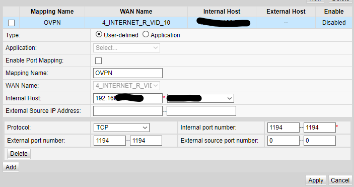
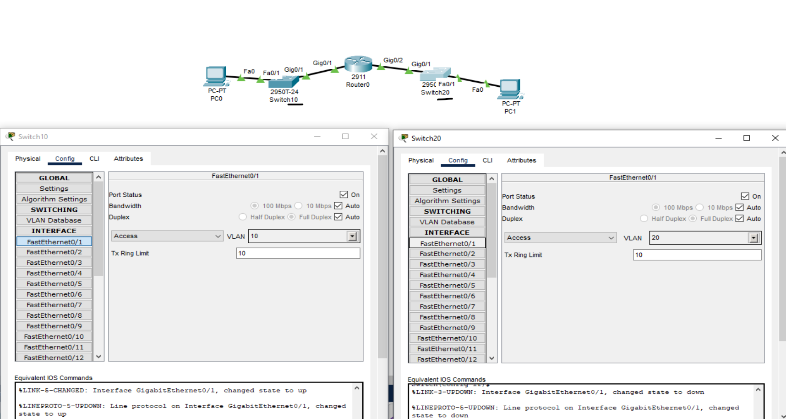
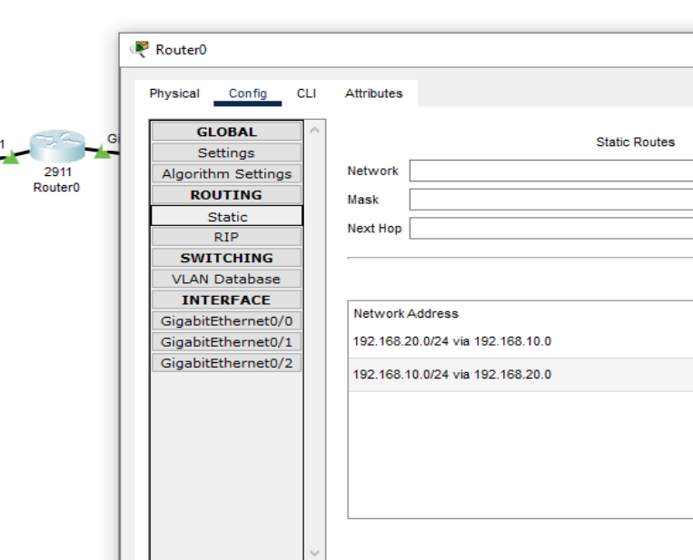
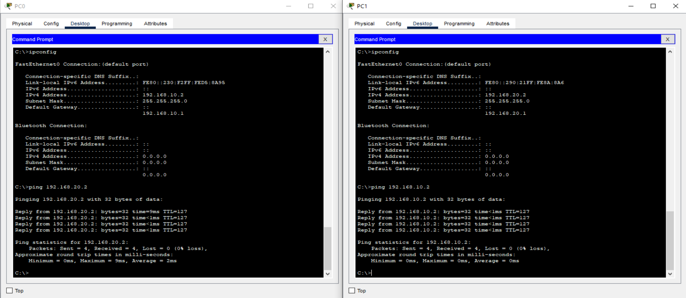
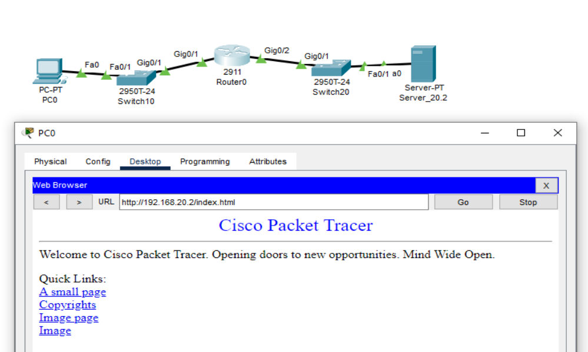

# Cyb04-onl

## ДЗ №5 Сети, маршрутизация. Часть 2

### 1. Изучить конфигурацию роутера.

● Зайти в настройки домашнего роутера
● Изучить настройки, сделать скрины настройки проброса портов приложений (на примере если бы вы хотели открыть доступ к домашнему веб-серверу)

### 2. Работа с Cisco Packet Tracer.

● Собрать базовую схему комп-свитч-роутер-свитч-комп
● Сегментировать сеть на 10 и 20 vlan, добиться видимости хостов
● Настроить сеть, добиться echo ping запросов между хостами
● Проследить на симуляции за пакетом ICMP

Настройка портов на коммутаторах

Таблица маршрутов

ICMP

*На 1 из сторон заменить хост на сервер, настроить на сервере web страничку, настроить NAT на роутере, добиться доступа по NAT inside global адресу к web серверу 

[//]: # ([Back to main](//Readme.md))  
[Back to main](https://github.com/andreyklass94/Cyb04/tree/main)