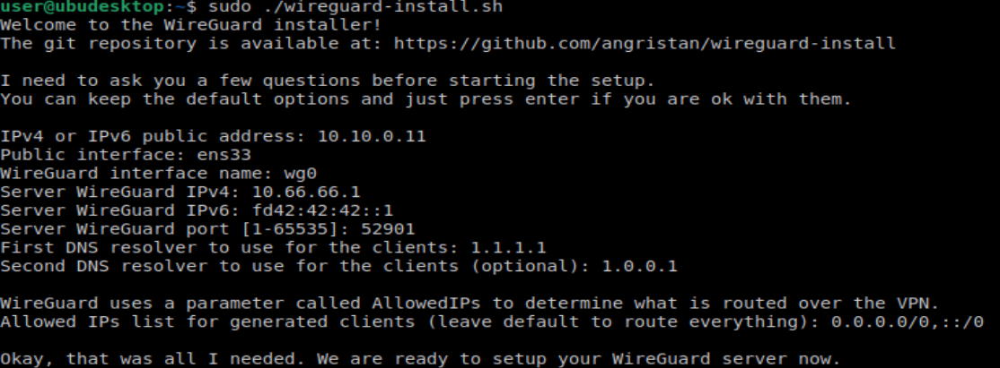
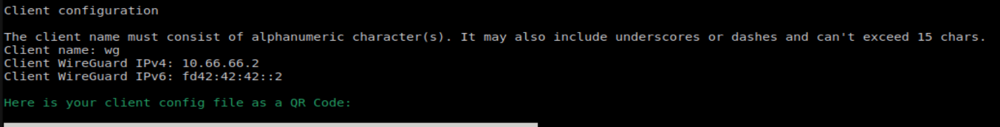
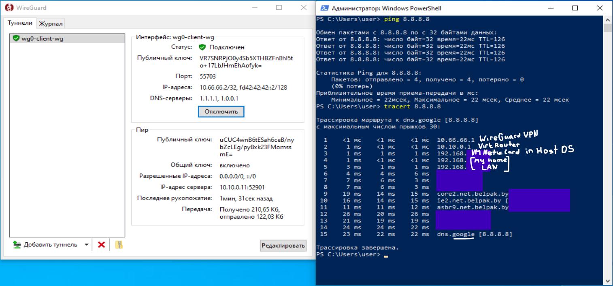

# Cyb04-onl

## ДЗ №6 Криптография

### На VM Uubuntu настроить SSH по лучшим практикам

[Manual](https://wiki.merionet.ru/articles/luchshie-praktiki-po-zashhite-ssh-podklyucheniya)

Сгенерировать на Windows host либо Kali linux VM (ssh-keygen) приватный и публичный ключ, добавить ключ (замок) ssh-add либо scp на ubuntu VM где настроили ssh

### Подключиться к ubuntu VM используя приватный ключ

[Manual](https://www.youtube.com/watch?v=Ld9xoFVeiS0)

На Windows устанавливаем PuTTY и в PuTTYKeyGenerator создаем публичный и приватный ключи.

Подключаемся к нашей Ubuntu машинке и кладем PublicKey в пaпку /home/user/.ssh/, в файл authorized_keys:

Сохраняем наш PrivateKey в C:\ssh\Priv.ppk и прописываем его в PuTTY для дальнейшей аутентификации с помощью этого ключа:

Сохранили профиль на будущее, жмем Open и подключаемся уже по ключу без ввода пароля от user@10.10.0.11:

### Настроить WireGuardVPN и организовать подключение по нему

[Manual](https://habr.com/ru/sandbox/189100/)

Устанавливаем WireGuardVPN на Ubuntu:
` curl -O https://raw.githubusercontent.com/angristan/wireguard-install/master/wireguard-install.sh `
`chmod +x wireguard-install.sh`
При установке все предлагаемые парамсетры оставляем по умолчанию:

В конце установки для подключения к WGVPN появился файл `/home/user/wg0-client-wg.conf`. Копируем его на гостевую ОС Windows 10, добавляем его в уcтановленный клиент WGVPN и устанавливаем соединение:

Как видим, наше VPN-соединение успешно установлено и пакетики бегут через VPN-сервер 10.66.66.1, затем через цепочку маршрутизаторов попадают в интернет.

[Back to main (GitHub)](https://github.com/andreyklass94/Cyb04/tree/main)  
[Back to main (PC)](\..\Readme.md)