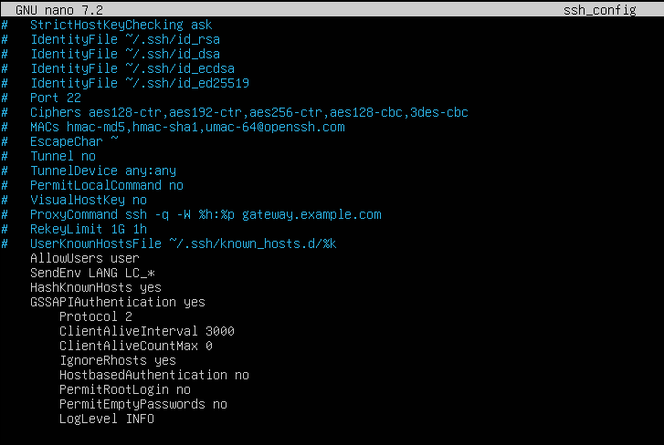
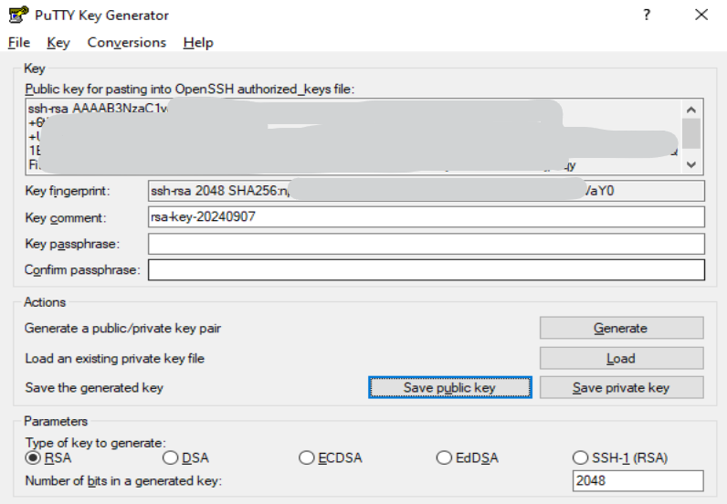
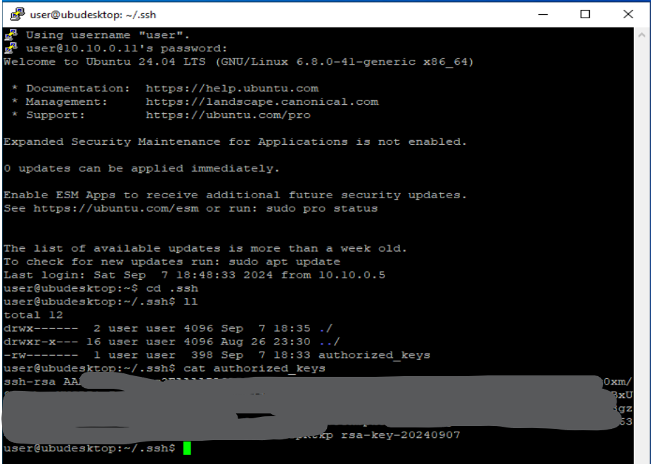
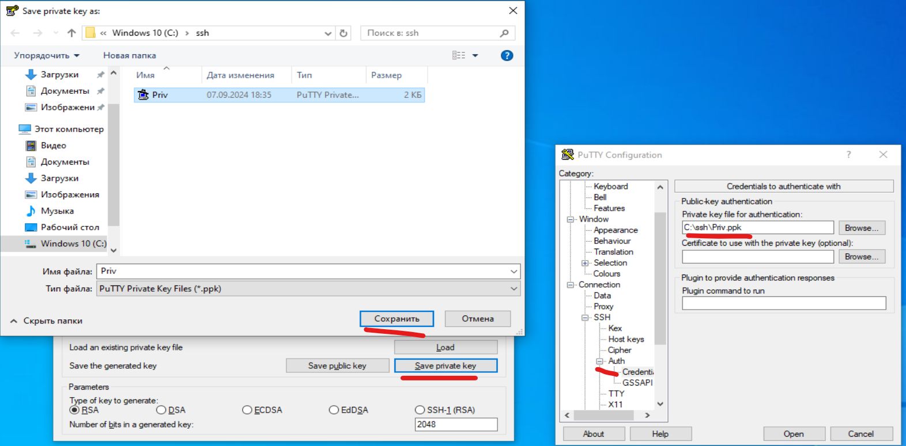
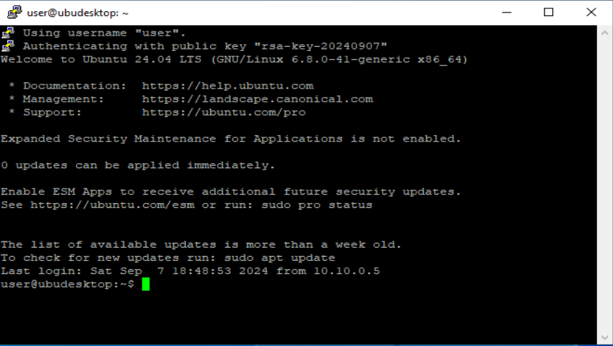

# Cyb04-onl

## ДЗ №6 Криптография

На VM Uubuntu настроить SSH по лучшим практикам

Сгенерировать на Windows host либо Kali linux VM (ssh-keygen) приватный и публичный ключ, добавить ключ (замок) ssh-add либо scp на ubuntu VM где настроили ssh
Подключиться к ubuntu VM используя приватный ключ

На Windows устанавливаем PuTTY и в PuTTYKeyGenerator создаем публичный и приватный ключи.

Подключаемся к нашей Ubuntu машинке и кладем PublicKey в пaпку /home/user/.ssh/, в файл authorized_keys:

Сохраняем наш PrivateKey в C:\ssh\Priv.ppk и прописываем его в PuTTY для дальнейшей аутентификации с помощью этого ключа:

Сохранили профиль на будущее, жмем Open и подключаемся уже по ключу без ввода пароля от user@10.10.0.11:

[//]: # (([Back to main](//Readme.md))  
[Back to main](https://github.com/andreyklass94/Cyb04/tree/main)