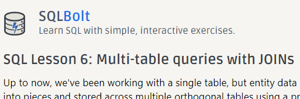
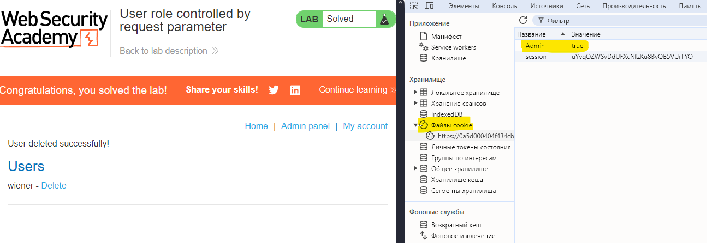

# Cyb04-onl

## ДЗ №7 Типы атак I, OWASP top 10

### 1. Изучить SQL запросы
[Пройти как можно больше заданий в SQLBOLT](https://sqlbolt.com/)

### 2. Лабораторные работы по OWASP TOP 10
[Lab Broken Access Controll 1](https://portswigger.net/web-security/access-control/lab-user-role-controlled-by-request-parameter):

[Back to main](https://github.com/andreyklass94/Cyb04/tree/main)