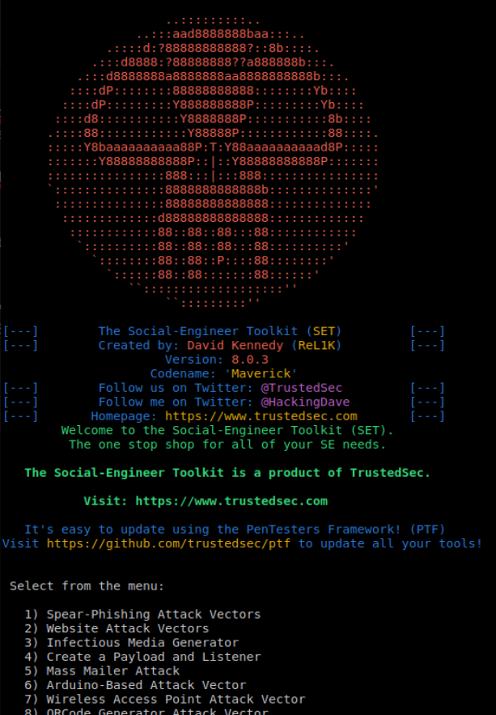
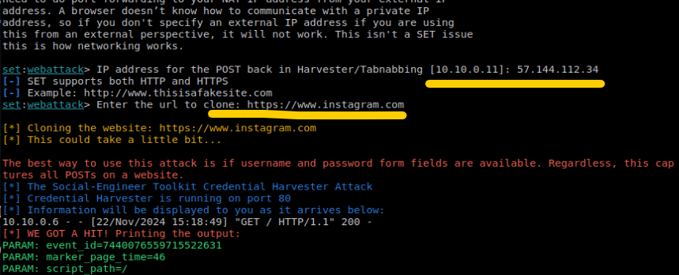
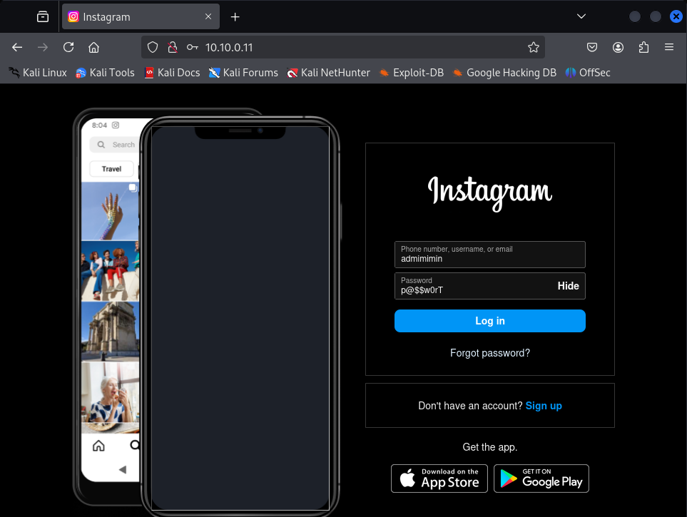
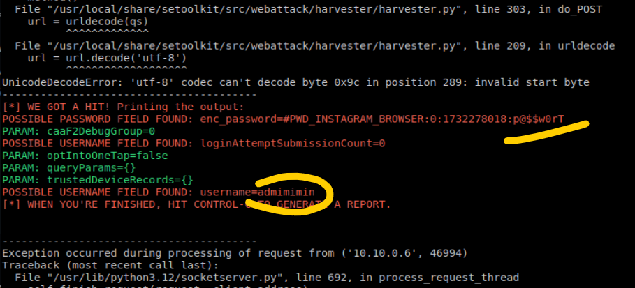

# Cyb04-onl

## ДЗ №9 Социальная инженерия, фишинг
Spam, Spam, Fishing, Social Engineering

### Разослать фишинговое письмо с уникальной информацией, ведущее на копию крупного ресурса (соцсети, почты и т.д.)
[Установить](https://www.youtube.com/watch?v=y4sIesUADD8) [setoolkit](https://github.com/trustedsec/social-engineer-toolkit) на Ubuntu VM 

`git clone https://github.com/trustedsec/social-engineer-toolkit/ setoolkit/`
`cd setoolkit`
`pip3 install -r requirements.txt` *- недостающее отсюда ставим руками*
`python setup.py`
`setoolkit` :

Пишем письмо и отправляем его человеку, маскируя [ссылку](http://10.10.0.11:80) на нужный сервис, и перехватываем введенные им данные авторизации:

Тот же функционал предоставляет сервис **GoPhish**

(Позже сделаю)

[Back to main (GitHub)](https://github.com/andreyklass94/Cyb04/tree/main)
